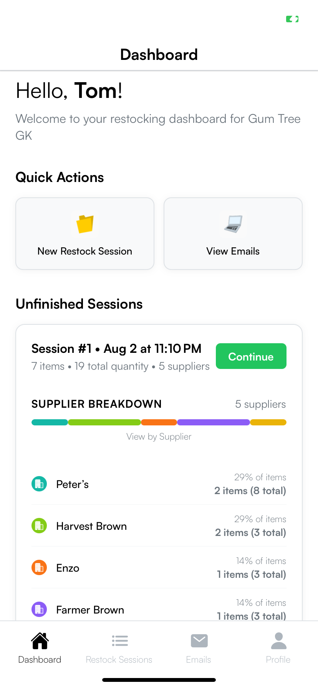

# Restock - Streamlining Restocking for Independent Retailers

## Main Screens
| App Icon | Onboard/Auth | Dashboard |
|----------|-----------|------------------|
|  |  |  |

## User Experience
| User Prompt | Session List |
|-------------|--------------|
|  |  |

## The Problem

Small business and grocery store owners often manage 50-200 product restocks per location manually. The traditional process involves:
- Walking the store with a clipboard to jot down product names
- Manually looking up each supplier
- Formatting individual emails
- Double-checking quantities
- Repeating this process for every store they manage

This is a slow, error-prone, and mentally draining process done several times a week.

## Our Solution

Restock is a mobile-first app that replicates the clipboard experience but with AI-powered email generation and a smart product-supplier database. The app enables users to:

- Log products quickly while walking the store
- Auto-link products to suppliers
- Generate and send professional emails in minutes
- Track past orders and save time every week

## Development Progress

### Current Status: **Advanced Email System & User Identity Integration**

**✅ COMPLETED PHASES**

- [x] **🏗️ Core Infrastructure**
  - React Native + Expo Router with TypeScript implementation
  - File-based routing with 4-tab navigation architecture
  - Complete Supabase database schema (6 tables with full relationships)
  - Comprehensive backend services layer (10+ services)
  - Production-grade authentication system using Clerk

- [x] **🔐 Authentication & Security**
  - Multi-provider authentication (email/password, Google SSO)
  - Email verification flow with password strength validation
  - Protected routes with session management
  - OAuth flow optimization with race condition fixes
  - User profile service with real-time data integration

- [x] **🤖 AI Integration**
  - GROQ API integration for fast, cost-effective email generation
  - Context-aware LLM prompts using authenticated user data
  - Professional email templates with dynamic personalization
  - Fallback email system for AI unavailability
  - Email regeneration with proper context passing

- [x] **📊 Data Management**
  - Complete CRUD operations for all entities
  - Real-time dashboard with Supabase integration
  - Session management with 20+ methods
  - Product/supplier autocomplete and validation
  - Email tracking and delivery status monitoring

- [x] **🎨 UI/UX Implementation**
  - Mobile-first design with sage green theme
  - Custom notification system with animations
  - Form validation and error handling
  - Email editing interface with visual feedback
  - Empty state handling and pull-to-refresh functionality
  - Loading skeletons and smooth transitions

- [x] **🧪 Quality Assurance**
  - Comprehensive Jest test suite (authentication flows)
  - React Native Testing Library for UI components
  - OAuth completion and session refresh testing
  - Integration testing for session management
  - TypeScript strict mode with full type safety

**🔄 IN PROGRESS**

- [ ] **📧 Email Delivery System**
  - Resend integration for actual email sending
  - Email delivery tracking and status updates
  - Bounce handling and retry mechanisms
  - Email template customization

- [ ] **🔒 Security Hardening**
  - Row Level Security (RLS) policies implementation
  - Data encryption and privacy compliance
  - Rate limiting and abuse prevention
  - Audit logging and monitoring

**📋 PENDING PHASES**

- [ ] **🚀 Production Deployment**
  - Environment configuration and app store preparation
  - CI/CD pipeline setup
  - Performance optimization and monitoring
  - App store submission and review process

- [ ] **📱 Mobile App Store Release**
  - iOS App Store submission
  - Google Play Store submission
  - Beta testing and user feedback collection
  - App store optimization (ASO)

- [ ] **🔄 Data Migration**
  - Transition from AsyncStorage to full Supabase integration
  - Data migration scripts and validation
  - Backup and recovery procedures
  - Performance optimization for large datasets

- [ ] **📊 Analytics & Monitoring**
  - User analytics and usage tracking
  - Performance monitoring and alerting
  - Error tracking and crash reporting
  - Business metrics dashboard

### Technical Architecture

**Frontend Stack**
- React Native with Expo SDK 53
- Expo Router (file-based routing)
- Zustand for state management
- NativeWind (Tailwind CSS) styling
- TypeScript with strict mode

**Backend Stack**
- Supabase (PostgreSQL database, authentication, edge functions)
- Clerk for authentication provider
- GROQ API for AI email generation
- Structured logging and error handling

**Development Tools**
- Jest + React Native Testing Library
- ESLint for code quality
- Custom component styling system
- Path aliases for clean imports

### Database Schema
- **Users**: Authentication and profile management
- **Products**: User's restock items with supplier defaults
- **Suppliers**: Contact information for ordering
- **Restock Sessions**: Session tracking with status management
- **Restock Items**: Products and quantities per session
- **Emails Sent**: Email tracking and delivery status

### Key Metrics
- **8,000+ lines of code** implemented
- **20+ reusable components** built
- **6 database tables** with full relationships
- **Complete authentication flows** with OAuth support
- **AI-powered email generation** with user personalization

## Progressive Learning & AI Enhancement

The app builds a database from the user's own data, learning and remembering product-to-supplier mappings over time:

- Initially, users input products manually as usual
- Over weeks, the system offers smarter autocomplete suggestions
- The AI uses this data to generate emails with minimal input from the user
- Eventually, the process shifts from manual entry toward smart, predictive restocking assistance

## Features

### Core Functionality
- Restock Sessions: Create and manage restocking sessions with real-time product tracking
- Smart Product Entry: Auto-complete suggestions based on previously used products
- Supplier Management: Automatic supplier linking and email generation
- Email Generation: AI-powered email creation grouped by supplier
- Session History: Track and review past restocking sessions

### User Experience
- Mobile-First Design: Optimized for on-the-go store walking
- Minimalistic UI: Clean, distraction-free interface following user preferences
- One-Task-Per-Screen: Mental simplicity with focused workflows
- Smart Suggestions: Progressive learning system for faster data entry

---

**Status**: 🚧 Active Development - 85% Complete

The main application code is located in the `restock/` directory. This is a mobile-first application designed for inventory management workflows.

